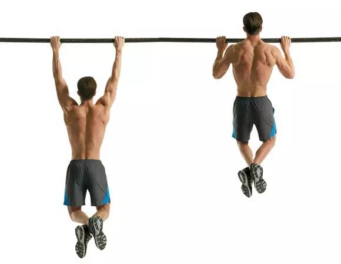

# Calistenia
Página web: [enalce](https://www.calistenia.net/rutinas-principiantes/)

## Calentamiento
1. [Movilidad articular](https://www.youtube.com/watch?v=0UKFJHnYEb8)
2. [Aumento de bombeo y preparación muscular](https://www.youtube.com/watch?v=suEih2E5Gjs)

## Lunes

| Ejercicio | Progresión | Tiempo | Descanso | Video |
|---|---|---|---|---|
|  | 6x4-5 / 5x6-7 / 4x8-10 / 3x10-12 | 3-0-X-1 | 1-1'5 min  | [vídeo](https://www.youtube.com/watch?v=qH3UlYIKZlI)  |
| Flexiones cerradas | 3x3-5 / 4x3-5 / 5x3-5 / 6x3-5| 3-0-X-1 | 1-1'5 min | [vídeo](https://www.youtube.com/watch?v=Fx1Tob4WvtM) |
| Salto vertical | 4x8-10 | Potente (máxima altura) | 2-3 min | [vídeo](https://www.youtube.com/watch?v=jj3NlAigrZ8)  |
| Encogemiento en barra + Superman | 5x3-5 + 20" / 4x-5-7 + 30" / 3x8-10 + 40" / 1xMAX + MAX | Controlado/Isométrico | 1-1'5 min | [vídeo](https://www.youtube.com/watch?v=hrEXL00wewI) |
| Flexiones inclinadas | 3x10-15 / 3x15-20 / 4x10-15 / 4x15-20 | 3-0-X-1 | 1 - 1'5 min | [vídeo](https://www.youtube.com/watch?v=EMSyI4RQn_o)
| Plancha | 4-6x20" / 4-6x30" / 3-5x40" / 3-5x50" | Isométrico | 1-1'5 min | [vídeo](https://www.youtube.com/watch?v=Els9E9R2u-8)

## Miércoles

| Ejercicio | Progresión | Tiempo | Descanso | Video |
|---|---|---|---|---|
| Dominada supina excéntrica | 3-4x3 / 4-5x3 / 5-6x3 / 6-7x3 | 5--- | 1'5-2'5 min | [vídeo](https://www.youtube.com/watch?v=Lgzaw7K1tYk) |
| Fondos de banco con pies en el suelo | MAX 1-2x10" / MAX 2-3x10" / MAX 3-4x10" / MAX 4-5x10"  | Rápido | 2-3 min | [vídeo](https://www.youtube.com/watch?v=eJx5ivmvmZk) |
| Australianas pronas | 4x3-5 / 6x3-5 / 4x5-7 / 6x5-7 | 5-1-X-1 | 1-1'5 min | [vídeo](https://www.youtube.com/watch?v=GSe8J1GVptk) |
| Sentadillas abiertas + cerradas | 3-4x10 + 10 / 4-5x10 + 10 / 5-6x10 + 10 / 6-7x10 + 10| 3-0-X-1 | 1-1'5 min | [vídeo](https://www.youtube.com/watch?v=jH2uIKIQ2oM) |
| Flexiones regulares | 5x4-6 / 3x7-9 / 2x10-12 / 3x10-12| 3-0-X-1 | 1-1'5 min | [vídeo](https://www.youtube.com/watch?v=xkXzjTfQ-KM) |
| Jumpings Jacks + Elevación de rodillas en paralelas | 4x20 + 5 / 4x25 + 10 / 3x30 + 15 / 3x35 + 20 | Rápido/2-0-2-0 | Mínimo | [vídeo](https://www.youtube.com/watch?v=Qjp_MJDwRi4) |

## Viernes

| Ejercicio | Progresión | Tiempo | Descanso | Video |
|---|---|---|---|---|
| Fondos excéntricos en paralelas | 3-4x3 / 4-5x3 / 5-6x3 / 6-7x3 | 5--- | 1'5-2'5 min | [vídeo](https://www.youtube.com/watch?v=55TuOn7FQKY) |
| Dominada supina parcial (mitad superior) | 3-4x3 / 5-6x3 / 3-4x5 / 5-6x5 | 3-0-X-1 | 1'5-2'5 min | [vídeo](https://www.youtube.com/watch?v=ypgrBUuuZfs&feature=youtu.be) |
| Contracción de escápula + Colgar | 3x3-5 + 10" / 5x3-5 + 10" / 3x5-7 + 20" / 5x5-7 + 20" | 2-1-X-3/Isométrico | 1-1'5 min | [vídeo](https://www.youtube.com/watch?v=c5zkTsa-Pr4&feature=youtu.be) |
| Sentadillas profundas | 5-6x1-5-1 / 4-5x2-10 / 3-4x2-10-2 / 2-3x1-10 | 3-0-X-1 | 10" entre escaleras, 1-1'5 min entre series | [vídeo](https://www.youtube.com/watch?v=KRjQVQWGVow&feature=youtu.be) |
| Flexiones declinadas | 5x4-6 / 4x6-8 / 3x8-10 / 4x8-10 | 3-0-X-1 | 1-1'5 min | [vídeo](https://www.youtube.com/watch?v=vBWF0ku_7d8) |
| Plancha lateral + Climbers | 1-2x10" + 2-10 / 1-2x10" + 2-10-2 / 2-3x10" + 2-10 / 2-3x10" + 2-10-2 | Isométrico/Rápido | 1-1'5 min entre series | [vídeo](https://www.youtube.com/watch?v=j-XZZmVbsmg) |