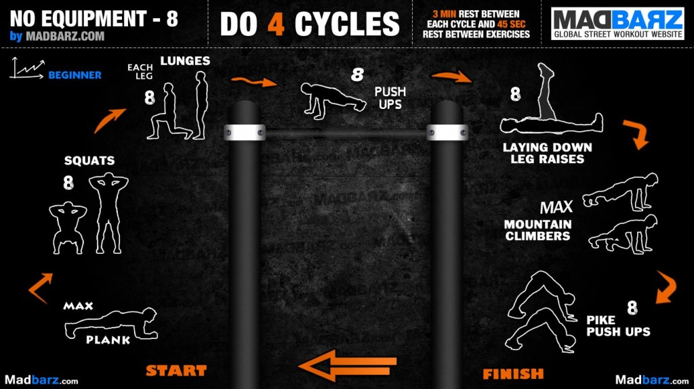

# Calistenia 2

Página web: [enalce](https://www.calistenia.net/rutinas-principiantes/)

## Calentamiento

1. [Movilidad articular](https://www.youtube.com/watch?v=0UKFJHnYEb8) (15"):
    - Movimiento circular de brazos hacia delante y hacia detrás
    - Apertura y cierre de brazos (abrazar a alguien)
    - Movimiento circular del tronco
    - Hacer círculos en el aire con los brazos extendidos
    - Tocar las punta del pie con la mano del brazo contrario
    - Movimiento circular de muñecas (en ambos sentidos)
    - Movimiento circular de antebrazo (en ambos sentidos)
    - Movimiento circular de cadera (en ambos sentidos)
    - Movimiento circular de rodillas (en ambos sentidos)
    - Balancearse sobre los tobillos hacia delantes y hacia atrás
    - Ponerse de puntillas
     
2. [Aumento de bombeo y preparación muscular](https://www.youtube.com/watch?v=suEih2E5Gjs) (10")
    - Zancada sobre el sitio con ambas piernas
    - Salto con apertura de brazos y piernas a la vez
    - Flexiones sobre una barra elevada
    - "Escalador" (correr en el sitio con las manos apoyadas)
    - Flexiones inversas inclinadas
    - Salto con rodillas a la altura del pecho
    - Semicírculo con los brazos extendidos y en 90 grados
    - Skipping
    - Sentadillas

## Rutinas

Los ejercicios vienen indicados con la cantidad de series,
el mínimo tiempo de descanso entre ejercicios y 4 minutos
entre serie y serie

| Ejercicio | Imagen |
|---|---|
| Full body 1 |  |
| Full body 2 |  | 
| Full body 3 |  |
| Full body 4 |  |
| Full body 5 |  |
| Abdominales |  |
| Hombro |  |
| Pecho |  |
| Piernas |  |
| Tríceps |  |
