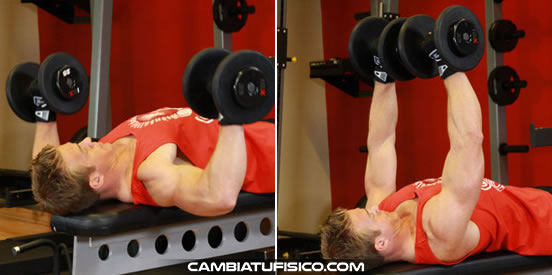
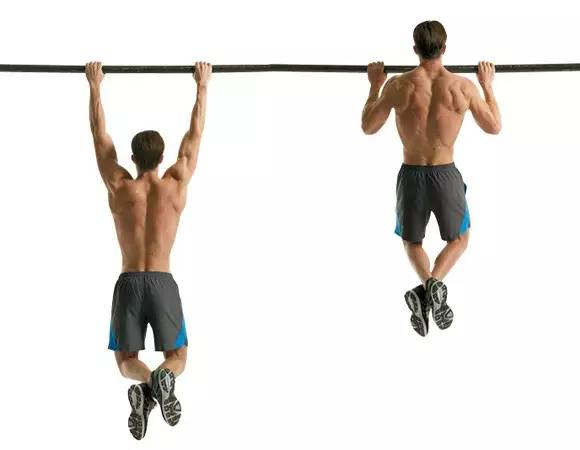
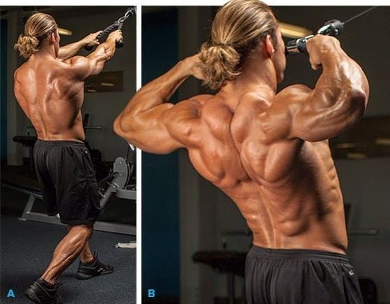
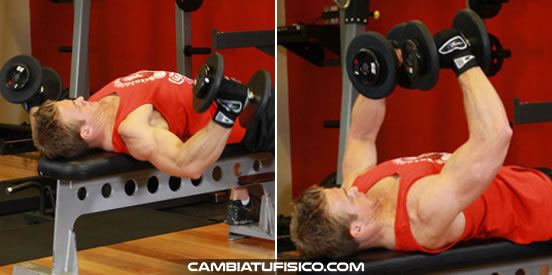
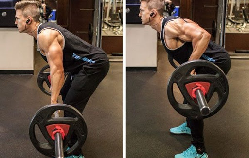
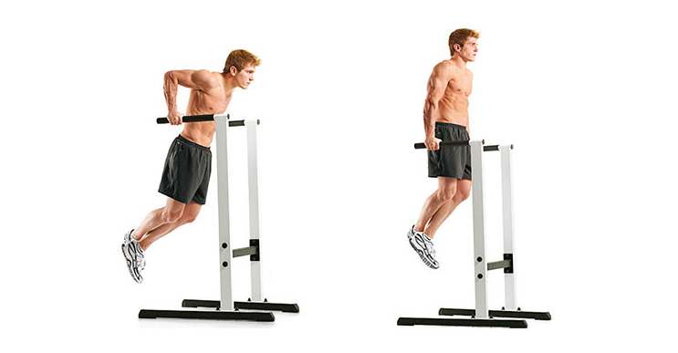
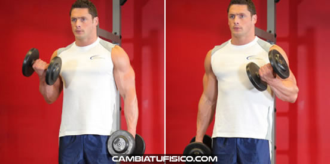
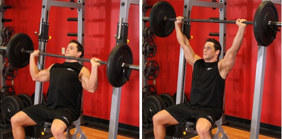
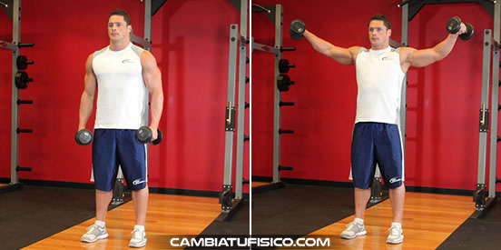
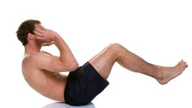

# Pesas

## Primer día

| Ejercicio | Series | Repeticiones | Descanso | Peso | Imagen |
|---|---|---|---|---|---|
| Press en banco plano con mancuernas | 3 | 12 | 90" | 10 | 
| Dominadas | 3 | 12 | 90" | 59 |  |
| Face pull | 3 | 12 | 90" | 32 |  |
| Apertura con mancuernas en banco plano | 3 | 12 | 90" | 8 |  |
| Remo cintura | 3 | 12 | 90" | 0 |  |
| Fondos en paralelas (tríceps) + Curl de bíceps alterno con mancuernas | 3 | 15+15 | 70" | 59+6 |   |
| Press frontal de hombros con barra | 3 | 10 | 60" | 15 (discos) o 20.5 (máquina) |  |
| Elevaciones laterales de pie | 3 | 12 | 90" | 5 |  |
| Abdominales rodillas al pecho | 8 | 8 | 8" |  |  |

## Segundo día